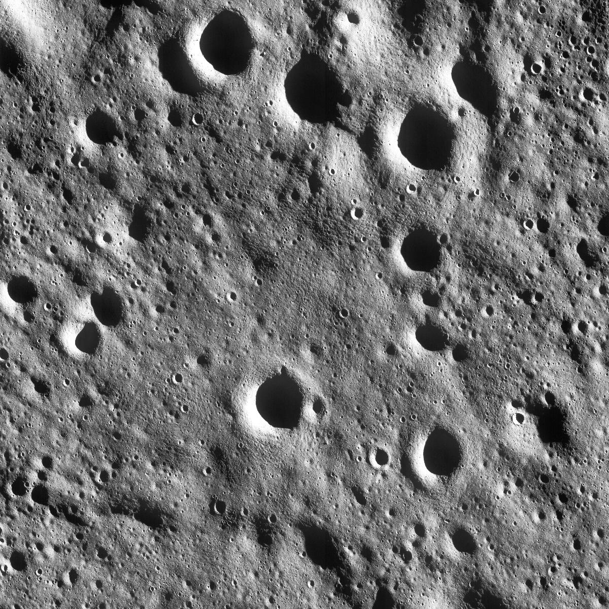
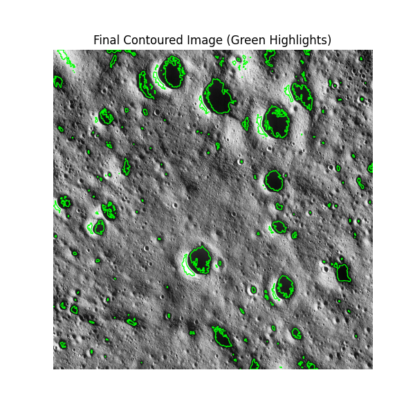

# Crater and Boulder Detection using Image Processing

A lightweight yet effective image-processing pipeline to detect craters and boulders in planetary surface images.  

This repository contains:
- A Jupyter Notebook demonstrating the end-to-end workflow (histogram equalization, Gaussian blur, edge detection, morphological ops, and contour detection).
- A research-paper-style PDF report (in docs/).
- Sample images (in data/images/) and outputs (in data/output_images/ and in data/single_image).

---

## Table of Contents
1. [Overview](#overview)
2. [Features](#features)
3. [Project Structure](#project-structure)
4. [Installation](#installation)
5. [Usage](#usage)
6. [Examples](#examples)
7. [Future Improvements](#future-improvements)

---

## Overview
This project aims to detect craters and boulders on planetary surfaces using **classical image processing** in Python (OpenCV).  
No deep learning models are used, making the solution efficient for devices with limited computational resources (e.g., rovers).

### Key Objectives
- Enhance image contrast using histogram equalization.
- Reduce noise using Gaussian blurring.
- Detect edges with the Sobel operator.
- Use morphological operations (erosion, dilation) to refine edges.
- Detect final contours representing craters and boulders.

---

## Features
- **Lightweight Pipeline**: Uses conventional OpenCV methods—fast on limited hardware.
- **Single Notebook Execution**: Everything is in one Jupyter Notebook for clarity.
- **PDF Report**: Detailed methodology, background, and references.

---

## Project Structure
- **notebooks/** contains the main Jupyter Notebook.
- **data/images/**: Raw input images used by the notebook.
- **data/output_images/**: Result images saved by the pipeline (could be empty initially).
- **data/single_image/**: Final single-image results for clarity.
- **docs/**: Contains the PDF project report and any additional documentation.

---

## Installation
1. **Clone the repository:**
   ```bash
   git clone https://github.com/YashPrajapati3000/Crater_and_Boulder_Detection_Image_Processing.git
   cd Crater_and_Boulder_Detection_Image_Processing

2. **Install dependencies:**
- Using pip:
  ```bash
  pip install -r requirements.txt

3. **Jupyter installation if you don’t already have it:**
   ```bash
   pip install jupyter

---

## Usage
1. **Launch Jupyter Notebook:**
   ```bash
   jupyter notebook notebooks/Crater_and_Boulder_Detection.ipynb
   
2. **Run all cells in the notebook:**
- This will read images from data/images/, apply the pipeline, and save outputs to data/output_images/ and data/single_image/.

3. **Examine Results:**
- Intermediate steps (histogram equalization, edges, morphological ops) are displayed in the notebook.
- Final contoured images get saved to the output folders.

## **Examples**
- Here’s a brief demonstration of the pipeline in action using one of the images:
 

1. **Original Grayscale Image**
- Shows the unprocessed input image directly from your data/images/ folder.
    

2. **Final Contoured Output**
- Shows the corresponding final result with detected craters and boulders highlighted, taken from data/single_image/.           |
  
---

## **Future Improvements**
- **Adaptive Thresholding:** Tackle extremely low-contrast or noisy images.
- **Parameter Tuning:** Automatic kernel sizes for blurring / morphological operations.
- **Incorporate Light ML:** Possibly combine classical and machine learning for tricky edge cases.
